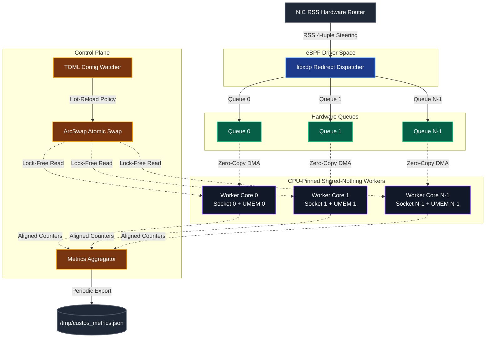

# Project Custos: High-Performance User-Space Security Gateway

Project Custos is an ultra-low latency, high-throughput user-space network security gateway built in Rust. By leveraging Linux **AF_XDP** (`socket(AF_XDP)`) sockets, Custos intercepts, parses, and validates gRPC and Protobuf payloads in the network fast path with **zero heap allocations** and **zero data copying**.

---

## Table of Contents
1. [High-Level Architecture](#high-level-architecture)
2. [Workspace Components](#workspace-components)
3. [Feature Matrix & Roadmap](#feature-matrix--roadmap)
4. [Hardware Configuration & Performance Expectations](#hardware-configuration--performance-expectations)
5. [Deployment Guides](#deployment-guides)
    - [A. Bare Metal Deployment](#a-bare-metal-deployment)
    - [B. Kubernetes Deployment (FD-Passing)](#b-kubernetes-deployment-fd-passing)
6. [Configuration Reference](#configuration-reference)
7. [Security Model & Threat Mitigation](#security-model--threat-mitigation)
8. [Troubleshooting & Run-time Errors](#troubleshooting--run-time-errors)
9. [Contribution Guidelines](#contribution-guidelines)

---

## High-Level Architecture

Custos is structured around a **shared-nothing, multi-core architecture**. Packet parsing, HTTP/2 frame inspection, Protobuf tag walking, and tensor shape validation are performed directly on packet descriptors.

### Component Design



---

## Workspace Components

Project Custos is organized as a Cargo workspace containing the following crates:

*   [common/](common/) - Core hardware configuration, thread pinning utilities (`sched_setaffinity` bindings), and shared definitions.
*   [phase1-echo/](phase1-echo/) - A basic L2 forwarding/echo engine implementing the busy-poll packet processing loop.
*   [phase2-grpc-basic/](phase2-grpc-basic/) - HTTP/2 and gRPC protocol frame parsing and destination port validation.
*   [phase3-protobuf/](phase3-protobuf/) - Zero-copy speculative tag walking, varint validation, and recursion limits.
*   [phase4-advanced/](phase4-advanced/) - High-scale production tooling:
    *   [multi-queue-sharding/](phase4-advanced/multi-queue-sharding/) - Multithreaded RSS-steered parser engine.
    *   [k8s-integration/](phase4-advanced/k8s-integration/) - Privilege separation daemon and workers communicating via `SCM_RIGHTS` file descriptor passing.
    *   [rules-engine/](phase4-advanced/rules-engine/) - Dynamic policy evaluator and lock-free hot-reloader using `arc_swap`.
    *   [tx-optimizations/](phase4-advanced/tx-optimizations/) - Batching algorithms and L1 prefetch instructions.

---

## Feature Matrix & Roadmap

| Feature | Phase 1 | Phase 2 | Phase 3 | Phase 4 | Status |
| :--- | :---: | :---: | :---: | :---: | :---: |
| AF_XDP Loop & Busy Poll | Yes | Yes | Yes | Yes | Production-ready |
| Zero Heap Allocations | Yes | Yes | Yes | Yes | Production-ready |
| L2/L3 MAC/IP Parsing | Yes | Yes | Yes | Yes | Production-ready |
| HTTP/2 & gRPC Framing | No | Yes | Yes | Yes | Production-ready |
| Protobuf Tag Walking | No | No | Yes | Yes | Production-ready |
| Dynamic Rules Engine | No | No | No | Yes | Production-ready |
| Lock-Free Policy Reload | No | No | No | Yes | Production-ready |
| RSS Multi-Queue Sharding | No | No | No | Yes | Production-ready |
| K8s SCM_RIGHTS FD Passing | No | No | No | Yes | Production-ready |
| Custom eBPF XDP Loader | No | No | No | Yes | Production-ready |
| static NUMA Thread Pinning| No | No | Yes | Yes | Production-ready |
| CPU Prefetch Instructions | No | No | No | Yes | Production-ready |
| dynamic eBPF Filtering | No | No | No | Future | In Design |
| static ML Anomaly Checker | No | No | No | Future | In Design |

---

## Hardware Configuration & Performance Expectations

Performance varies significantly based on driver binding modes and CPU characteristics.

### Performance Profile by Deployment Type

1.  **Virtual Interfaces / Docker (Copy/SKB Mode)**
    *   **Throughput**: 100k - 250k PPS (Packets Per Second) per core.
    *   **p99 Latency**: 25 - 50 microseconds.
    *   **Bottleneck**: Traversing the virtual ethernet interface (`veth`) triggers OS context switches and copying data packets to kernel SKBs.
2.  **Native BIOS Drivers / Bare Metal (Zero-Copy Mode)**
    *   **Throughput**: 8.0M - 12.0M PPS per core.
    *   **p99 Latency**: < 10 microseconds.
    *   **Bottleneck**: CPU clock speed and memory bandwidth limits.
3.  **Horizontal Scale (8 Cores, Native Zero-Copy)**
    *   **Throughput**: 55M - 65M PPS.
    *   **p99 Latency**: < 8 microseconds.

> [!TIP]
> Always align network card hardware interrupts to the CPU cores executing Custos. For instance, if Custos workers run on CPU cores 2-5, pin the NIC queue interrupts to cores 2-5 using `irqbalance` and `ethtool`.

---

## Deployment Guides

### A. Bare Metal Deployment

#### 1. BIOS Tuning
*   Disable **Intel SpeedStep** / **AMD Cool'n'Quiet** (energy saver modes).
*   Set CPU Governor to `Performance` mode.
*   Enable **Hugepages** (2MB or 1GB size) to reduce Translation Lookaside Buffer (TLB) misses.

#### 2. Operating System Tuning
```bash
# Set 2MB hugepages (allocate 1024 hugepages)
sysctl -w vm.nr_hugepages=1024

# Set scaling governor to performance for all CPU cores
for CPU in /sys/devices/system/cpu/cpu*/cpufreq/scaling_governor; do
    echo performance > $CPU
done

# Disable Hyper-Threading on worker cores to eliminate L1/L2 cache contention
echo 0 > /sys/devices/system/cpu/cpu{X}/online
```

#### 3. Network Card Setup
```bash
# Configure 8 queues
sudo ethtool -L eth0 combined 8

# Distribute flows evenly
sudo ethtool -X eth0 equal 8

# Enforce 4-tuple hashing (IP + Port)
sudo ethtool -N eth0 rx-flow-hash tcp4 sdfn
```

#### 4. Run the Daemon
```bash
sudo ./target/release/custos-multi-queue-sharding --interface eth0 --queues 4 --cores "2,4,6,8"
```

---

### B. Kubernetes Deployment (FD-Passing)

The Kubernetes integration implements **least privilege separation**:
1.  **`custos-k8s-daemon`**: Runs as a privileged DaemonSet to manage socket bindings.
2.  **`custos-k8s-worker`**: Runs as an unprivileged, locked-down worker pod.

```
                  Privileged Host Namespace (DaemonSet)
                      +--------------------------+
                      |   custos-k8s-daemon      |
                      |  - socket(AF_XDP)        |
                      |  - memfd_create(UMEM)    |
                      +------------+-------------+
                                   |
                         SCM_RIGHTS | Unix Domain Socket (/var/run/custos/custos.sock)
                                   v
                 Unprivileged Sandbox Namespace (Pod)
                      +--------------------------+
                      |   custos-k8s-worker      |
                      |  - mmap(UMEM, rings)     |
                      |  - walk_protobuf()       |
                      +--------------------------+
```

To deploy on Kubernetes:
1.  Copy `seccomp-profile.json` to Kubelet folder:
    ```bash
    cp phase4-advanced/k8s-integration/manifests/seccomp-profile.json /var/lib/kubelet/seccomp/custos-seccomp-profile.json
    ```
2.  Deploy daemon and workers:
    ```bash
    kubectl apply -f phase4-advanced/k8s-integration/manifests/daemonset.yaml
    kubectl apply -f phase4-advanced/k8s-integration/manifests/deployment.yaml
    ```

---

## Configuration Reference

### Command Line Arguments (All-in-One CLI Options)

| Option | Crate Target | Purpose | Default |
| :--- | :--- | :--- | :--- |
| `-i, --interface <VAL>` | All | Network Interface to bind to. | None (Required) |
| `-c, --core <VAL>` | Phase 1, 2 | Target CPU core to pin worker thread. | `0` |
| `-q, --queue-id <VAL>` | Phase 1, 2 | Interface hardware queue ID. | `0` |
| `--queues <VAL>` | Sharding, K8s | Total RSS queues to allocate. | `NumCores / 2` |
| `--cores <VAL>` | Sharding | Comma-separated worker CPU affinity list. | Local NUMA |
| `-f, --frame-count <VAL>` | All | Number of frames in UMEM ring. | `2048` |
| `-m, --mode <VAL>` | All | Fast path mode: `drop`, `forward`, `echo`. | `forward` |
| `-t, --target-port <VAL>` | Phase 2, 4 | Target Port for gRPC traffic validation. | `50051` |
| `--config <PATH>` | Phase 3, 4 | Path to TOML or JSON policy config file. | None |
| `--force-copy` | All | Force Linux copy mode (`XDP_COPY`). | Auto |
| `--force-zerocopy` | All | Force zero-copy driver mode (`XDP_ZEROCOPY`).| Auto |

### TOML Policy Configuration (`rules.toml`)
```toml
# Policy Metadata
version = "1.0.0"
description = "AI Inference Security Gateway Policy"

# Connection Rules
allowed_ports = [50051, 8001]
blocked_ips = ["192.168.10.25", "10.0.99.1"]

[protobuf_rules]
max_varint_bytes = 9
max_recursion_depth = 4
field_allow_list = [1, 2, 3, 4]  # Allowed top-level field tags

# Shape Constraints on specific fields
[[protobuf_rules.shape_rules]]
field_number = 3              # Tensor shape payload field
min_dimensions = 2            # Rank >= 2
max_dimensions = 4            # Rank <= 4
max_tensor_elements = 1048576  # Limit total element count

# Bounds on specific indices
[[protobuf_rules.shape_rules.dimension_bounds]]
index = 0                     # Batch dimension
min = 1
max = 8

[[protobuf_rules.shape_rules.dimension_bounds]]
index = 1                     # Channels dimension
min = 3
max = 3
```

---

## Security Model & Threat Mitigation

Custos provides high robustness against common edge-network vectors:

1.  **Stack Overflow / Recursion Limit**: Deeply nested Protobuf wrappers designed to crash the stack trigger a safety block when the depth exceeds `max_recursion_depth` (default 3, max 100).
2.  **CPU Exhaustion / Varint Bloat**: Malicious varints padded with redundant leading zeros (e.g. 10+ bytes) are blocked immediately by enforcing `max_varint_bytes` limits (default 9 bytes).
3.  **Privilege Dropping**: The packet validation loop operates completely inside an unprivileged worker container. If an attacker exploits a buffer overflow in the Rust runtime, they cannot escape the pod container or access host networking due to the lack of capabilities and strict seccomp whitelisting.
4.  **Buffer Wrapping / Descriptor Leaks**: UMEM buffers are pre-allocated during start-up. No allocations occur in the poll loop. Packets are recycled inline back to the Fill queue, avoiding leaks and heap fragmentation.

---

## Troubleshooting & Run-time Errors

### 1. `Operation not supported` on startup
*   **Cause**: The network interface driver does not support native zero-copy.
*   **Fix**: Pass `--force-copy` to fall back to Linux virtual SKB copy-mode, or verify your NIC driver is compiled with XDP zero-copy support (e.g., `i40e`, `mlx5_core`, `igb`).

### 2. Colima VM networking quirks (macOS)
*   **Cause**: Docker containers inside Colima VM run on virtual networking interfaces (`veth`) which do not support hardware zero-copy.
*   **Fix**: Always run in copy-mode inside VM local environments. Ensure that `docker-compose` mounts host directories with read/write permissions.

### 3. Descriptor Starvation / Packet Drops
*   **Cause**: The Fill Queue is starved because the Completion Queue is not being processed fast enough (high completion ring pressure).
*   **Fix**: Increase `comp_queue_size` and UMEM frame count in arguments. Ensure worker threads are pinned to separate cores from the NIC hardware interrupts to prevent CPU context switching.

---

## Contribution Guidelines

If you are contributing code, rules, or tests, please review:
*   [agents.md](agents.md) - AUTHORITATIVE developer conventions.

### Critical Rules Checklist
1.  **No panics in the hot path**: Do not use `unwrap()`, `expect()`, or `panic!` inside fast loops.
2.  **Zero allocations in the hot path**: No `Vec`, `String`, `Box` or dynamic pointer creation inside packet loops.
3.  **Unsafe justification**: Every `unsafe` block must be accompanied by a `// SAFETY: <reason>` comment.
