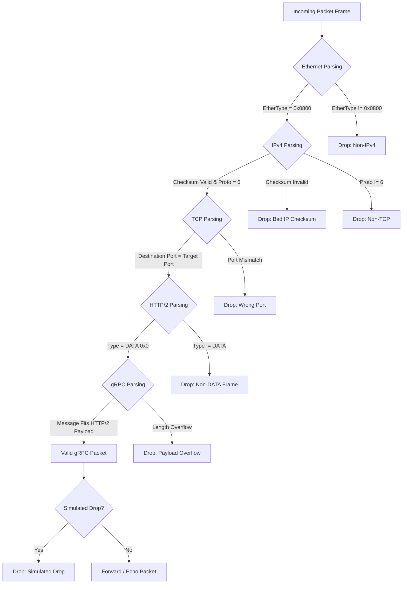

# Custos Phase 2: Header Stripping and gRPC Validation

This sub-crate implements the Phase 2 zero-copy header validation engine. It extends the single-core AF_XDP poll loop from Phase 1 by recursively parsing and validating Ethernet, IPv4, TCP, HTTP/2, and gRPC layers in-place with zero heap allocations.

## Architecture

- **Zero-Copy Parser**: Casts the raw packet bytes directly into header structure views using `zerocopy` layout traits.
- **Cheap Checksumming**: Computes and validates the 20-byte IPv4 header checksum.
- **Bounds Checking**: Enforces safety by checking packet length at each protocol boundary, ensuring header fields do not cause buffer overflows.
- **Drop Simulation**: Uses a high-performance Xorshift PRNG to simulate drop rates of otherwise valid packets.
- **Dynamic Diagnostics**: Reports packet type statistics, validation failure breakdowns, and simulated drops every 1 second.

## Parsing Flow Diagram



## Validation Logic

1. **Ethernet Validation**: Verifies length is at least 14 bytes and `ether_type` matches `0x0800` (IPv4).
2. **IPv4 Validation**: Parses IHL (Internet Header Length), verifies length is sufficient, checks protocol is TCP (`6`), and calculates the 16-bit one's complement Internet checksum over the IP header bytes.
3. **TCP Validation**: Parses destination port, verifies it matches the target validation port (default `50051`), and extracts the payload offset from the TCP data offset field.
4. **HTTP/2 Validation**: Parses the 9-byte frame header, verifies the frame type is `DATA` (`0x0`), and extracts the 24-bit payload length.
5. **gRPC Validation**: Parses the 5-byte gRPC header, extracts the message length, and asserts that the gRPC message fits inside the HTTP/2 DATA payload boundary.

## Build and Run

To compile and check locally:
```bash
cargo build --release -p custos-grpc-basic
```

To run the binary:
```bash
sudo ./target/release/custos-grpc-basic --interface veth0 --queue-id 0 --frame-count 2048 --mode echo --target-port 50051 --drop-rate 0.1
```

### CLI Arguments
*   `-i, --interface`: Name of the network interface.
*   `-c, --core`: CPU core to pin the polling thread (default: `0`).
*   `-q, --queue-id`: Queue index of the network interface (default: `0`).
*   `-f, --frame-count`: Number of UMEM frames (default: `2048`).
*   `-m, --mode`: Mode of operation (`forward` or `echo`).
*   `-t, --target-port`: Target port to validate gRPC packets for (default: `50051`).
*   `--drop-rate`: Simulated packet drop rate from `0.0` to `1.0` (default: `0.0`).
*   `-v, --verbose`: Enables verbose tracing of parsed headers and parsing errors.

## Performance Comparison to Phase 1

- **Phase 1 (Echo/Forward)**: Only parsed the 14-byte Ethernet header. It runs with minimal CPU instructions and maximizes raw throughput.
- **Phase 2 (gRPC Validation)**: Parses 5 protocol layers (Ethernet, IPv4, TCP, HTTP/2, gRPC), computes the IPv4 checksum, performs port matching, checks bounds, and simulates drop rates.
- **Performance Impact**: Due to in-place zero-copy parsing (avoiding heap allocations or copying), the overhead is low.
  - **SKB Mode**: In SKB mode, performance is bounded by generic Linux networking stack traversal. Phase 2 performance is identical to Phase 1 (~100k-250k PPS).
  - **Native/DRV Mode**: In native driver mode, Phase 2 is expected to run at **85% - 92%** of Phase 1's processing capacity (e.g. processing ~8M-10M PPS per core).
