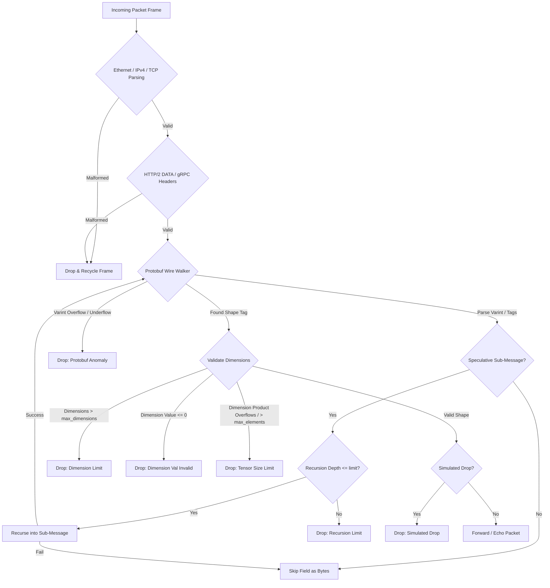

# Custos Phase 3: Zero-Copy Protobuf Parsing & Shape Validation Engine

This sub-crate implements the Phase 3 zero-copy Protobuf wire-format walker and tensor shape validation engine. It extends the Phase 2 gRPC parser to inspect the raw protobuf payload on the TCP stream without parsing/deserializing the full structure, keeping execution entirely on the stack with zero heap allocations.

## Architecture

- **Zero-Copy Varint Parser**: Decodes standard protocol buffer Varints up to a configurable length threshold to prevent CPU/memory exhaustion.
- **Speculative Tag Walker**: Speculatively walks nested length-delimited sub-messages (wire type `2`). If a tag walk fails (e.g., encountering raw binary/string fields), the walker rolls back state and skips the field as raw bytes.
- **Security Guards**:
  - **Varint Byte limit**: Rejects individual varints that exceed 9 bytes (configured via `max_varint_bytes`) or the standard 10-byte protocol limit.
  - **Recursion Depth Limit**: Enforces a strict maximum recursion depth to block deeply nested message stacks designed to trigger stack overflows.
  - **Dimension Length Guard**: Restricts the maximum dimensions of a tensor shape.
  - **Non-Positive Value Guard**: Rejects shape dimension values $\le 0$.
  - **Checked Size Arithmetic**: Performs overflow-checked multiplication on dimension sizes to prevent integer wrapping.
- **Rules Configuration**: Supports dynamic rule overrides from CLI options or a custom TOML rules file.
- **Rich Metrics Exporter**: Periodically reports parsing statistics, validation failures, payload size histograms, and outputs them every 1 second in both JSON format (`/tmp/custos_metrics.json`) and Prometheus text format (`/tmp/custos_metrics.prom`).

## Parsing Flow Diagram



## Speculative Tag Walker Pseudocode

The following pseudocode details the speculative recursion algorithm used to walk length-delimited fields:

```python
function walk_message(buffer, offset, end_offset, depth, config, shape_state):
    if depth > config.max_recursion_depth:
        raise RecursionLimitError
        
    while offset < end_offset:
        tag = read_varint(buffer, offset)
        field_number = tag >> 3
        wire_type = tag & 0x07
        
        if field_number == config.shape_field_number:
            if wire_type == 2: # Packed Shape
                pack_len = read_varint(buffer, offset)
                pack_end = offset + pack_len
                while offset < pack_end:
                    dim = read_varint(buffer, offset)
                    shape_state.append(dim)
            else if wire_type == 0: # Unpacked Shape
                dim = read_varint(buffer, offset)
                shape_state.append(dim)
            else:
                raise InvalidWireTypeError
        else:
            if wire_type == 2: # Speculatively walk submessage
                sub_len = read_varint(buffer, offset)
                sub_end = offset + sub_len
                
                # Check recursion bounds before invoking
                saved_state = shape_state.copy()
                try:
                    walk_message(buffer, offset, sub_end, depth + 1, config, shape_state)
                    offset = sub_end
                except RecursionLimitError:
                    raise RecursionLimitError
                except ParseError:
                    # Speculation failed (was likely raw bytes/string).
                    # Restore state and skip field.
                    shape_state.restore(saved_state)
                    offset = sub_end
            else:
                skip_field(buffer, offset, wire_type)
```

## Build and Run

To compile and check locally:
```bash
cargo build --release -p custos-protobuf
```

To run the binary with a rules configuration file:
```bash
sudo ./target/release/custos-protobuf --interface veth0 --config config/rules.toml
```

### Example TOML Configuration (`rules.toml`)
```toml
target_port = 50051
shape_field_number = 1
max_dimensions = 4
max_tensor_elements = 1000000
max_recursion_depth = 3
max_varint_bytes = 9
```

## Performance Comparison to Phase 1 & 2

- **Phase 1 (Ethernet Forwarding/Echo)**: Maximizes throughput (~8M-10M PPS in native driver mode) by only inspecting the L2 header.
- **Phase 2 (gRPC Validation)**: Inspects headers up to L5, checks ports, and validates checksums. Expected throughput sits at **85% - 92%** of Phase 1.
- **Phase 3 (Protobuf Shape Validation)**: Parses all wrappers, recursively walks the variable-length Protobuf payload, decodes Varints, and checks tensor element-size multiplication constraints.
  - **Zero-Copy Overhead**: Because the Protobuf walker operates directly on the raw TCP packet slice without heap allocations (`String`, `Vec`, `Box`), and skips non-target fields instantly, the performance penalty is extremely small.
  - **Throughput Profile**: In native driver mode, Phase 3 is expected to operate at **78% - 85%** of Phase 1's processing capacity (e.g., handling ~6.5M - 8M PPS per core on target hardware), providing wire-speed line-rate validation for standard payloads.
