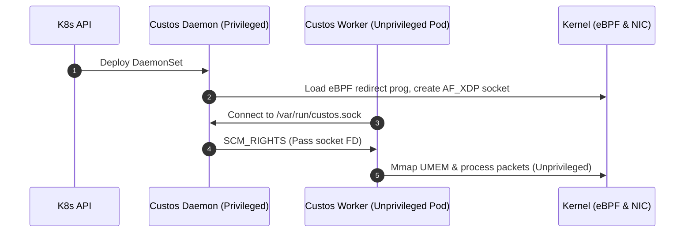

# Custos Phase 4: Advanced Scaled Architecture & Deployment Master Guide

This directory holds the production-grade, highly-scalable components of Project Custos. Phase 4 extends the single-core AF_XDP processing pipeline into a multi-core, Kubernetes-integrated, NUMA-aware, dynamically configurable security appliance.

```
phase4-advanced/
├── Cargo.toml                 # Phase 4 workspace manifest
├── README.md                  # Master roadmap & deployment guide (this file)
├── k8s-integration/           # Kubernetes daemon, eBPF loader, SCM_RIGHTS FD passing
│   ├── Cargo.toml
│   └── src/
│       └── lib.rs
├── multi-queue-sharding/      # Multi-core thread pinning & RSS queue steering
│   ├── Cargo.toml
│   └── src/
│       └── lib.rs
├── rules-engine/              # Hot-reloaded lock-free policy matching
│   ├── Cargo.toml
│   └── src/
│       └── lib.rs
└── tx-optimizations/          # Batching, prefetching, and NUMA-aligned transmit paths
    ├── Cargo.toml
    ├── README.md
    └── src/
        ├── bin/
        │   └── bench_tx.rs
        └── lib.rs
```

---

## Sub-Components & Dependencies

1. **`multi-queue-sharding`**:
   - **Purpose**: Leverages multi-queue NICs and RSS (Receive Side Scaling) to scale packet processing horizontally.
   - **Dependencies**: `custos-common` (for core affinity/thread pinning), `custos-tx-optimizations`, `tracing`.
   - **Conventions**: Strict shared-nothing thread architecture; each CPU core runs a dedicated AF_XDP event poll loop on a unique RSS queue.
2. **`k8s-integration`**:
   - **Purpose**: Handles privilege separation, allowing unprivileged worker containers to validate packet streams in Kubernetes.
   - **Dependencies**: `tracing`, `nix`.
   - **Conventions**: Runs a privileged Node Daemonset loader (root) that instantiates eBPF redirect programs and passes AF_XDP socket file descriptors to unprivileged pods over a UNIX domain socket via `SCM_RIGHTS`.
3. **`rules-engine`**:
   - **Purpose**: High-speed dynamic matching engine for AI inference and shape validation policies.
   - **Dependencies**: See [`rules-engine/Cargo.toml`](rules-engine/Cargo.toml).
   - **Conventions**: See [`rules-engine/README.md`](rules-engine/README.md) for policy syntax, hot-reload mechanics, and fast-path constraints.
4. **`tx-optimizations`**:
   - **Purpose**: Throughput optimization of the transmission path.
   - **Dependencies**: `custos-common`, `libc`, `tracing`, and `xsk-rs` on Linux.
   - **Conventions**: Batching of TX submissions, platform-specific prefetching of UMEM descriptors, NUMA-node core affinity, and a mock benchmark path for non-Linux development. See `tx-optimizations/README.md` for benchmark usage.

---

## Production Deployment Guide

### A. Bare Metal Deployment

On bare metal, performance is maximized by operating directly in native driver mode (XDP_ZEROCOPY).

#### 1. Hardware Tuning & BIOS
- **Enable Hugepages**: Allocate 2MB hugepages at boot time.
  ```bash
  sysctl -w vm.nr_hugepages=1024
  ```
- **Disable CPU Power Saving**: Set CPU frequency governor to `performance`.
  ```bash
  for CPU in /sys/devices/system/cpu/cpu*/cpufreq/scaling_governor; do echo performance > $CPU; done
  ```
- **Interface RSS Configuration**: Configure the NIC to map queue interrupts to dedicated cores.
  ```bash
  ethtool -L eth0 combined 8
  ```

#### 2. Running Custos-Sharded
Run the multi-queue sharding binary pinning workers to isolated cores:
```bash
sudo ./target/release/custos-sharded --interface eth0 --queues 0,1,2,3 --cores 2,3,4,5
```

---

### B. Kubernetes Deployment (Secure FD-Passing Flow)



#### 1. Node Daemonset (Privileged Control Plane)
- Runs with host privileges.
- Mounts `/sys/fs/bpf` and `/var/run/custos/` host directories.
- Binds AF_XDP socket and loads eBPF.

#### 2. Worker Pod (Unprivileged Data Plane)
- Connects to Daemonset socket `/var/run/custos/fd.sock`.
- Receives file descriptor using SCM_RIGHTS passing.
- Performs `mmap` on the shared UMEM buffers.
- Runs packet parsing safely without root capabilities.

---

## Scaling Targets & Prometheus Monitoring

### Scaling Targets
| Metric | Single-Core Target | 8-Core Sharded Target |
| :--- | :--- | :--- |
| **Throughput (SKB Mode)** | ~250k PPS | ~1.5M PPS |
| **Throughput (Native Zero-Copy)** | ~8M PPS | ~55M - 60M PPS |
| **Latency (p99)** | < 15 microseconds | < 8 microseconds |

### Monitoring Setup
Custos exports Prometheus metrics on `http://localhost:9090/metrics` or to `/tmp/custos_metrics.prom`:
- `custos_rx_packets` (Counter): Total packets received.
- `custos_anomalies_total{reason="tensor_size_limit"}` (Counter): Shape anomalies.
- `custos_recycled_packets` (Counter): Rings buffer metrics.

---

## Production Hardening Checklist

- [ ] **Thread Isolation**: Isolating CPU cores via `isolcpus` in GRUB parameters to avoid kernel scheduler interruptions.
- [ ] **Privilege Separation**: Ensured worker pod seccomp profiles restrict root capabilities (`CAP_SYS_ADMIN` dropped, only `CAP_NET_RAW` / `CAP_NET_ADMIN` retained during fd receive).
- [ ] **Memory Protection**: UMEM descriptors bounds checks validated and protected against buffer wrapping.
- [ ] **Lockless Fast Path**: Confirmed clippy has validated all fast loops have zero locking operations.

---

## Future Extensions

### 1. eBPF Userspace Integration
Replacing generic kernel routing by compiling custom eBPF XDP programs that perform pre-filtering directly in driver space before passing frames to the userspace socket.

### 2. Machine Learning Anomaly Detection
Integrating flat, zero-copy inference runtimes (such as Tract or ONNX Runtime with static memory allocation) inside the fast path to analyze shape patterns and classify tensor content anomaly signatures in real-time.
