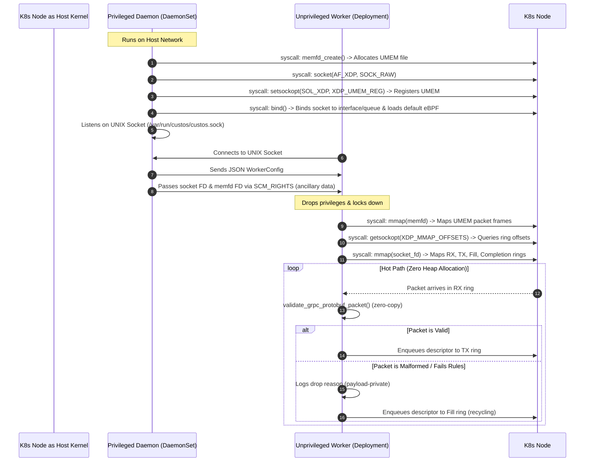

# Phase 4: Kubernetes Integration with Privilege Separation for Custos

This directory contains the implementation of Kubernetes support for **Custos**, a high-performance network security appliance. 

To achieve maximum safety and follow the principle of least privilege, the design decouples the **privileged setup operations** (creating AF_XDP sockets, binding to physical interfaces, and loading eBPF/XDP programs) from the **unprivileged packet processing operations** (parsing gRPC HTTP/2 headers and walking Protobuf wire-format structures).

---

## Architecture Flow

The system is partitioned into two components:
1. **Privileged Host Daemon (`custos-k8s-daemon`)**: Runs as a `DaemonSet` with elevated privileges (`CAP_NET_RAW`, `CAP_NET_ADMIN`, `CAP_SYS_ADMIN`) and host network access. It performs all socket setup, registers the UMEM region, binds the socket, and attaches BPF filters.
2. **Unprivileged Worker (`custos-k8s-worker`)**: Runs as a standard `Deployment` with no capabilities, restricted system calls, and a read-only root filesystem. It inherits resources from the daemon.

### Communication and Initialization Sequence



---

## Security Model

Security is a primary design goal in Phase 4. We implement defense-in-depth across multiple layers:

### 1. Privilege Dropping & Least Privilege
* The **DaemonSet** only runs on the nodes requiring security analysis. It adds only three capabilities (`NET_ADMIN`, `NET_RAW`, `SYS_ADMIN`) rather than running with full root `privileged: true`.
* The **Worker Pod** runs completely unprivileged. Its security context enforces:
  ```yaml
  allowPrivilegeEscalation: false
  privileged: false
  readOnlyRootFilesystem: true
  runAsNonRoot: true
  runAsUser: 10001
  capabilities:
    drop:
    - ALL
  ```
  It has absolutely zero permissions on the host system. It cannot modify routing tables, load kernel modules, or intercept raw traffic on other interfaces.

### 2. Seccomp Syscall Filtering
The worker pod is locked down with a custom seccomp profile (`custos-seccomp-profile.json`) which denies all syscalls by default (`SCMP_ACT_ERRNO`) and explicitly allows only the 20 system calls required for AF_XDP ring operations and standard Rust runtime functionality:
* `recvmsg` is used to receive the FDs via `SCM_RIGHTS`.
* `getsockopt` is used to read the XDP ring offsets.
* `mmap`/`munmap` are used to map the rings and the shared UMEM memfd.
* `poll` and `sendto` are used for need_wakeup operations on RX and TX queues.
* `sched_setaffinity` is used for NUMA-aligned thread pinning.

### 3. AppArmor Policies (Recommendations)
It is recommended to run the worker pod under a strict AppArmor profile to restrict filesystem access:
```ini
profile custos-worker-profile flags=(attach_disconnected) {
  # Deny all writes by default
  file,
  
  # Allow connecting to the Unix socket
  /var/run/custos/custos.sock rw,
  
  # Allow read access to libraries and basic resources
  /lib/** r,
  /usr/lib/** r,
  /etc/ld.so.cache r,
}
```

---

## Kubernetes Manifests Walkthrough

The `manifests/` directory contains:

1. **`daemonset.yaml`** ([daemonset.yaml](file:///Users/jpvalent/.treehouse/Custos-1475d5/2/Custos/phase4-advanced/k8s-integration/manifests/daemonset.yaml)): Deploying the host daemon. Configures:
   * `hostNetwork: true` to bind to the host's actual interfaces.
   * `volumeMounts`: Shares `/var/run/custos` with the host (mapped as `DirectoryOrCreate` hostPath) so the Unix Domain Socket is exposed to workers on the same node.
2. **`deployment.yaml`** ([deployment.yaml](file:///Users/jpvalent/.treehouse/Custos-1475d5/2/Custos/phase4-advanced/k8s-integration/manifests/deployment.yaml)): Deploying the unprivileged worker pods.
   * Mounts the UDS directory.
   * Defines resource limits and requests, including standard hugepages configuration for high-performance memory translation.
3. **`seccomp-profile.json`** ([seccomp-profile.json](file:///Users/jpvalent/.treehouse/Custos-1475d5/2/Custos/phase4-advanced/k8s-integration/manifests/seccomp-profile.json)): The strict syscall whitelist profile.

---

## How to Test and Run

### Local Simulation (Veth Simulation)

To test the entire flow locally on a Linux development machine, we provide a simulation script:
```bash
sudo ./sim-test.sh
```
This script:
1. Creates a virtual ethernet pair (`veth_sim` <-> `veth_peer`) to simulate host interface traffic.
2. Starts the privileged daemon, which binds the socket to `veth_sim` and listens on a temporary UDS.
3. Spawns the worker running as the unprivileged user `nobody`.
4. Injects a mock gRPC protobuf packet into `veth_peer` using Python Scapy.
5. Verifies the worker successfully receives the FDs, maps the memory, parses the packet, and logs the shape validation.

### Deploying on Kind / Minikube

1. **Copy the Seccomp profile to the host's Kubelet directory**:
   ```bash
   # In Kind, copy to the node's local seccomp folder
   docker cp manifests/seccomp-profile.json <node-name>:/var/lib/kubelet/seccomp/custos-seccomp-profile.json
   ```
2. **Deploy the DaemonSet**:
   ```bash
   kubectl apply -f manifests/daemonset.yaml
   ```
3. **Deploy the Worker Pods**:
   ```bash
   kubectl apply -f manifests/deployment.yaml
   ```

---

## Troubleshooting Guide

### 1. `Operation not supported` on `getsockopt`
* **Reason**: This occurs if the kernel doesn't support the `SOL_XDP` options (older kernel versions, e.g. `< 5.4`) or if the socket FD is not fully bound yet.
* **Solution**: Ensure your Linux kernel is updated (recommended `5.15` or above) and verify that the daemon bound the socket successfully without error before passing it.

### 2. `Permission Denied` when connecting to UDS
* **Reason**: The daemon is running as `root` and creates the UDS socket file owned by `root:root`. The worker (running as user `10001`) does not have permission to connect to it.
* **Solution**: The daemon must set permissions of the socket file `/var/run/custos/custos.sock` to `0666` or change the group ownership to match the worker's group ID.

### 3. High CPU usage in worker pod
* **Reason**: Polling loop is running continuously in a tight `loop` to achieve sub-microsecond latency. This is expected behavior for DPDK/AF_XDP engines.
* **Solution**: Ensure that CPU manager policy on the Kubernetes node is set to `static` so that the polling thread is pinned to a dedicated core, eliminating context switching.

### 4. eBPF loader failures
* **Reason**: Loading XDP programs requires `CAP_SYS_ADMIN` and locked memory limit configurations.
* **Solution**: Ensure the DaemonSet pod has the correct capabilities in its security context and that `RLIMIT_MEMLOCK` is configured to unlimited.
