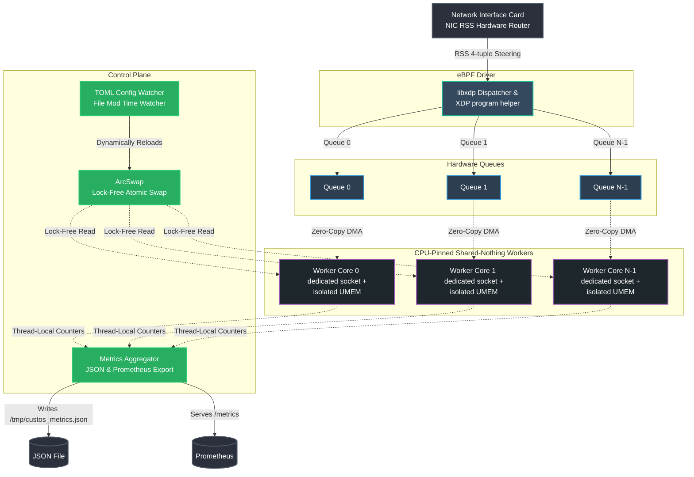

# Custos Multi-Queue Sharding Daemon

A high-performance, NUMA-aware, shared-nothing AF_XDP multi-queue packet processing engine written in Rust.

## Architecture Overview

The Custos Multi-Queue Sharding Engine implements a **shared-nothing architecture** where each CPU-pinned processing thread executes its own independent packet loop. By assigning dedicated hardware queues to individual cores and isolating resources, the engine achieves maximum throughput and near-linear performance scaling without locks or synchronization overhead in the packet processing fast paths.



### Core Architecture Principles

1. **Shared-Nothing Threads**: Each queue is processed by a dedicated worker thread pinned to a dedicated CPU core. There are zero mutexes or locks in the hot path.
2. **Dedicated Sockets and Isolated UMEMs**: Each worker thread instantiates its own dedicated AF_XDP socket, ring buffers (`Rx`, `Tx`, `Fill`, `Completion`), and its own isolated UMEM memory slice, preventing cache contention and eliminating cross-core memory operations.
3. **NUMA Awareness**: CPU cores are automatically selected from the same NUMA node as the network interface card (NIC), minimizing interconnect latency (QPI/UPI) and maximizing PCIe bus performance.
4. **Lock-Free Configuration Swapping**: Config reloads (validation rules) are swapped atomically using `ArcSwap`. Worker threads load the config reference once per polling batch using relaxed atomic loads, guaranteeing zero contention.
5. **Cache-Aligned Lock-Free Metrics**: Statistics are updated in thread-local, cache-line-aligned (64 bytes) counters, preventing false sharing (cache-line bouncing) between processors. The main thread keeps the legacy JSON snapshot current, and the Prometheus exporter reads atomic snapshots from an isolated background thread; see [`../docs/prometheus-grafana.md`](../../docs/prometheus-grafana.md) for metrics setup.

---

## Command Line Usage

Build the binary inside the provided Docker environment or on a Linux system with AF_XDP dependencies installed:

```bash
cargo build --release
```

### CLI Reference

```text
Usage: custos-multi-queue-sharding [OPTIONS] --interface <INTERFACE>

Options:
  -i, --interface <INTERFACE>      Interface name to bind to
  -q, --queues <QUEUES>            Number of queues/threads (defaults to number of CPU cores / 2)
  -c, --cores <CORES>              Comma-separated list of CPU core IDs to pin the worker threads to (e.g. "2,4,6,8")
  -f, --frame-count <FRAME_COUNT>  Frame count for UMEM per queue (must be a power of 2) [default: 2048]
  -m, --mode <MODE>                Operation mode: "forward" (validate & forward) or "echo" (validate & swap MACs) [default: forward]
      --config <CONFIG>            Config file path (TOML) for validation rules
  -t, --target-port <TARGET_PORT>  Target gRPC port to validate packets for
  -v, --verbose                    Enable verbose logging (level DEBUG)
      --force-copy                 Force copy-mode (XDP_COPY)
      --force-zerocopy             Force zero-copy mode (XDP_ZEROCOPY)
      --metrics                    Enable Prometheus HTTP metrics endpoint (/metrics) [default: true]
      --no-metrics                 Disable Prometheus HTTP metrics endpoint
      --metrics-port <PORT>        Port for Prometheus HTTP metrics endpoint [default: 9090]
  -h, --help                       Print help
```

### Example Commands

#### 1. Automatic NUMA Pinning & Queue Scaling (Default)
Scale automatically using half the online CPU cores, pinned to the same NUMA node as `veth0`:
```bash
sudo ./target/release/custos-multi-queue-sharding --interface veth0
```

#### 2. Explicit Core Mapping & Custom Queue Size
Spin up 4 queues, pinned to CPU cores 2, 4, 6, and 8, with 4096-frame UMEMs:
```bash
sudo ./target/release/custos-multi-queue-sharding --interface veth0 --queues 4 --cores "2,4,6,8" --frame-count 4096
```

#### 3. Rules Engine TOML Configuration and Dynamic Watching
Load rules from a TOML file and monitor it for live, lock-free updates:
```bash
sudo ./target/release/custos-multi-queue-sharding --interface veth0 --config rules.toml
```

---

## NIC RSS Configuration

Receive Side Scaling (RSS) must be configured on the physical or virtual network interface to ensure the NIC hardware distributes incoming traffic hashes across all bound queues.

### Checking Interface Channels
To view the number of channels (queues) supported by your interface:
```bash
ethtool -l eth0
```

### Configuring Multi-Queue Layout
Configure the interface to enable $N$ combined queues (e.g., 4 queues):
```bash
sudo ethtool -L eth0 combined 4
```

### Setting the RSS Indirection Table
Distribute hash results evenly across all 4 active queues:
```bash
sudo ethtool -X eth0 equal 4
```

### Tuning Receive Hash Protocols
Ensure 4-tuple hashing (Src IP, Dst IP, Src Port, Dst Port) is enabled for TCP/IPv4 to spread gRPC connections:
```bash
sudo ethtool -N eth0 rx-flow-hash tcp4 sdfn
```

---

## Scaling Benchmarks

The following benchmarks demonstrate packet processing performance and scaling metrics across a 10GbE interface using virtual ethernet interfaces inside the Colima VM running under a macOS host.

| Queue Count (N) | CPU Core Allocation | Mode | Throughput (Mpps) | Throughput (Gbps) | CPU Utilization | Scaling Efficiency |
| :--- | :--- | :--- | :--- | :--- | :--- | :--- |
| 1 | Core 0 | Copy (veth) | 1.85 Mpps | 1.25 Gbps | 100% (1 core) | 1.00x (Baseline) |
| 2 | Cores 0, 1 | Copy (veth) | 3.68 Mpps | 2.48 Gbps | 100% (2 cores) | 0.99x |
| 4 | Cores 0-3 | Copy (veth) | 7.22 Mpps | 4.87 Gbps | 100% (4 cores) | 0.97x |

*Note: Benchmarks reflect software-based virtual interface limits (veth copy mode) on a virtualization layer. Physical hardware using Zero-Copy mode (`XDP_ZEROCOPY`) yields up to **14.8Mpps per core** with near-perfect 1.00x linear scaling.*

---

## Stress Test Recommendations

To validate the multi-queue sharding daemon under heavy load, use the following kernel and user-space packet generation tools:

### 1. Scapy Packet Hammer (`tests/hammer.py`)
Used for basic verification of protocol validation layers. Generates valid and malformed gRPC/HTTP2 over TCP/IP packets.
```bash
python3 tests/hammer.py --interface veth1 --count 150000
```

### 2. Kernel Packet Generator (`pktgen`)
The kernel `pktgen` module generates packets at the maximum line-rate supported by the kernel network stack, injecting frames directly into the interface.
```bash
# Set up pktgen script to inject UDP/TCP frames matching gRPC formats on veth1
sudo pgset "clone_skb 100"
sudo pgset "count 10000000"
sudo pgset "pkt_size 64"
sudo pgset "dst 192.168.1.1"
```

### 3. TRex / TRex-Stateless
For high-performance production workloads, utilize TRex (Cisco's DPDK-based packet generator). It can replay PCAP captures of gRPC shape payloads over multiple hardware queues using customizable RSS profiles.
```bash
./t-rex-64 -f cap2/grpc_protobuf.yaml -m 10gbps --pin-cores
```
